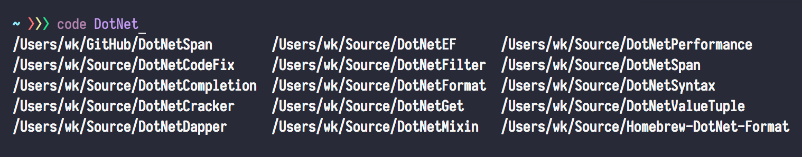

## Easy Way to Open Recent VS Code Project from Command Line (fish)



## Installing

```bash
brew install jq
wget https://raw.githubusercontent.com/wk-j/code-completion/master/src/code.fish --output-document ~/.config/fish/code.fish
echo "source ~/.config/fish/code.fish" >> ~/.config/fish/config.fish
```

## Usage

```
code keyword<TAB><TAB><ENTER>
```